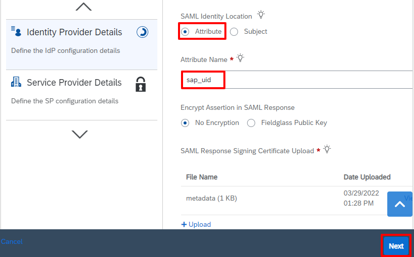
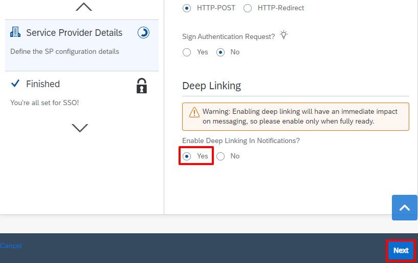
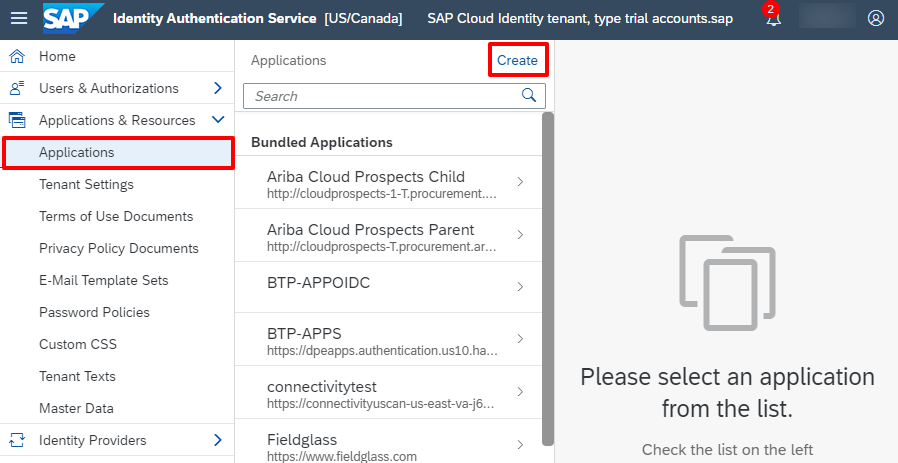
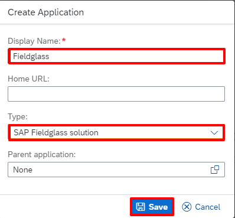
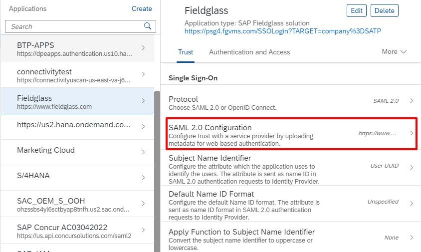
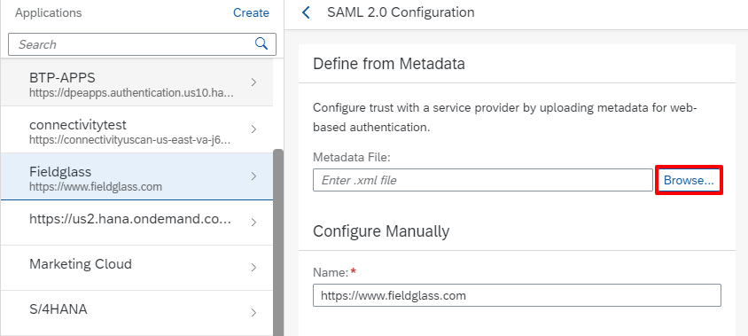
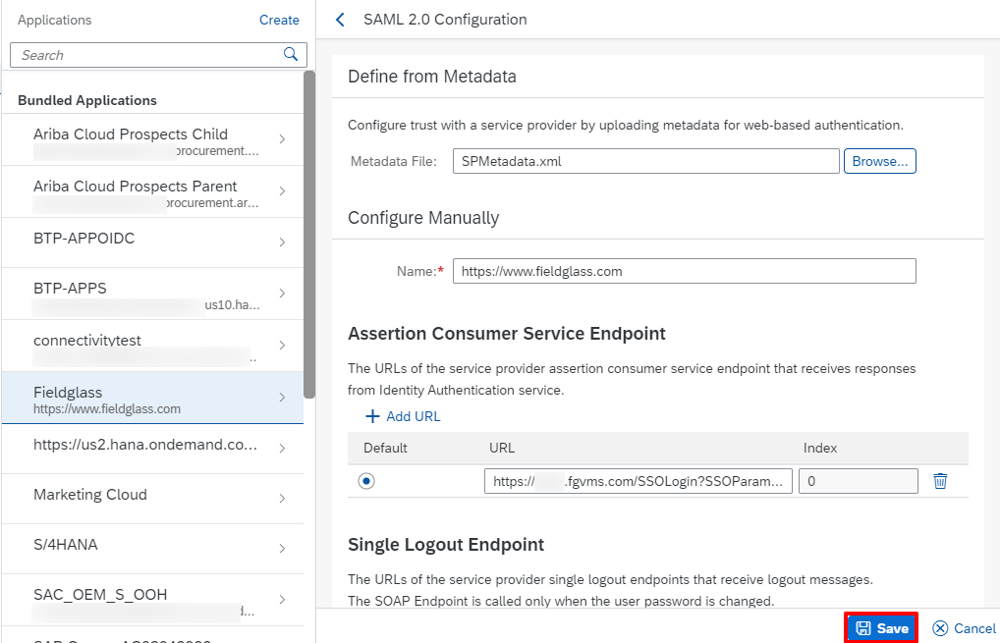
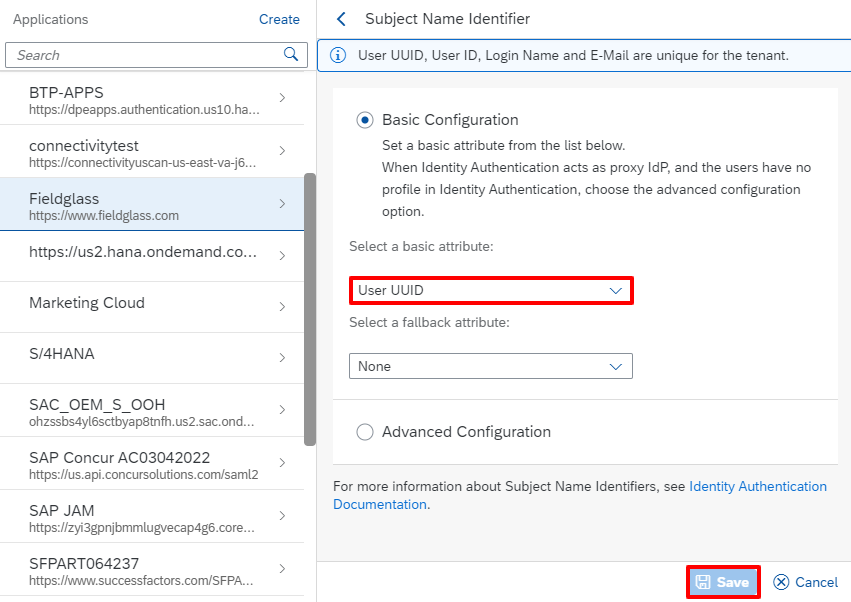
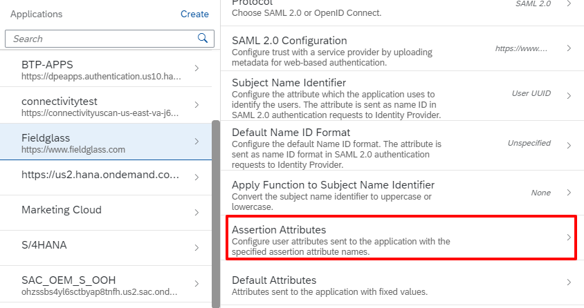

1. Download the **SAML 2.0 metadata** file from the Administration Console of Identity Authentication service or use the URL `https://<Identity_Authentication_tenant>.accounts.ondemand.com/saml2/metadata`.  
  
2. Go to SAP Fieldglass and choose the **Configuration Manager** user.  
  
3. Choose the **View Single Sign-On** tile.  
  
4. On the **Single Sign-On** Setup page, choose **Edit**.  
  
5. In the **Identity Provider Details** section, choose the **Upload** button to upload the client's metadata file using the **Identity Provider Metadata Import** tool.  
  

6. Choose **Attribute** as the **SAML Identity Location**, in the **Attribute Name** text box, type `sap_uid`, and choose **Next**.  
  
7. In the **Service Provider Details** section, choose **Yes** for the **Enable Deep Linking In Notifications?** property, and choose **Next**.  
  
8. The **Finished** step opens, confirming you have finished the SSO setup, and choose **Exit Wizard**.  
  
9. Choose **Actions -> Download SP Metadata**.  
  
10. Go to your Identity Authentication Service Admin Console. Create a new application under **Applications**.   
  
11. Enter the **name** of your SAP Fieldglass tenant and choose **SAP Fieldglass solution** as the type of your application.  
  
12. Choose **SAML 2.0 Configuration**.  
  
13. Choose **Browse** to upload SAP Fieldglass metadata.  
  
14. **Save** the configuration.  
  
15. Choose **Subject Name Identifier**.  
  
16. Select **User UUID** as a basic attribute and **save**.  
  
17. Choose **Assertion Attributes**.  
  
18. Modify the **User UUID** mapping to be **sap_uid** and **save**.  
  
19. Contact SAP Fieldglass Customer Support at [https://www.fieldglass.com/customer-support](https://www.fieldglass.com/customer-support) to request assistance with enabling the custom script `sso.sapid2uname` for the company. 

