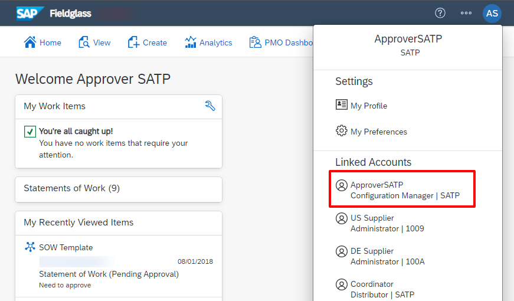
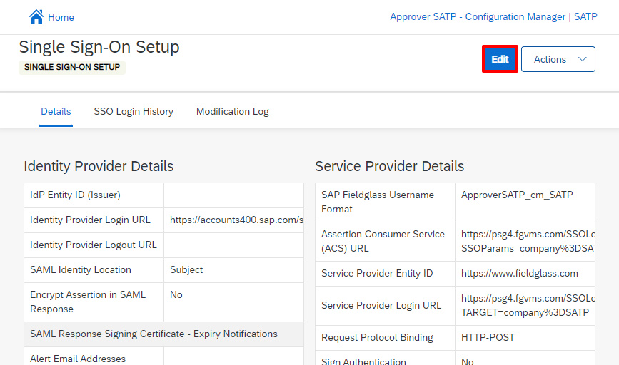
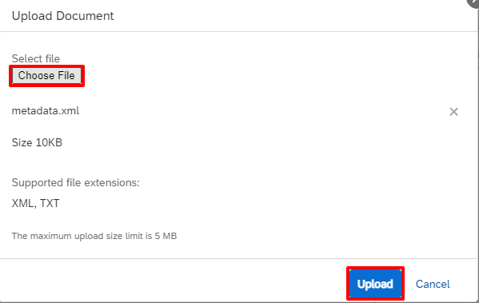
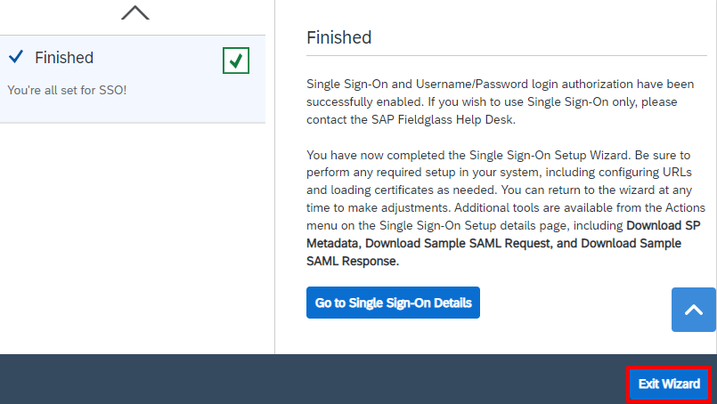

1. Download the **SAML 2.0 metadata** file from the Administration Console of Identity Authentication service or using the URL https://<Identity_Authentication_tenant>.accounts.ondemand.com/saml2/metadata

2. Go to SAP Fieldglass and choose the **Configuration Manager** user.

3. Click on **View Single Sign-On** Tile.

4. On the Single Sign-On Setup page, choose **Edit**.

5. In the **Identity Provider Details** section, choose the **Upload** button to upload the client's metadata file using the **Identity Provider Metadata Import** tool.

6. In the **SAML Identity Location** property, choose **Attribute**, and in the **Attribute Name** text box, type sap_uid, click **Next**.

7. In the **Service Provider Details** section, choose **Yes** for the **Enable Deep Linking In Notifications?** property, click **Next**.

8. The **Finished** step opens, confirming you have finished SSO setup, click **Exit Wizard**.

